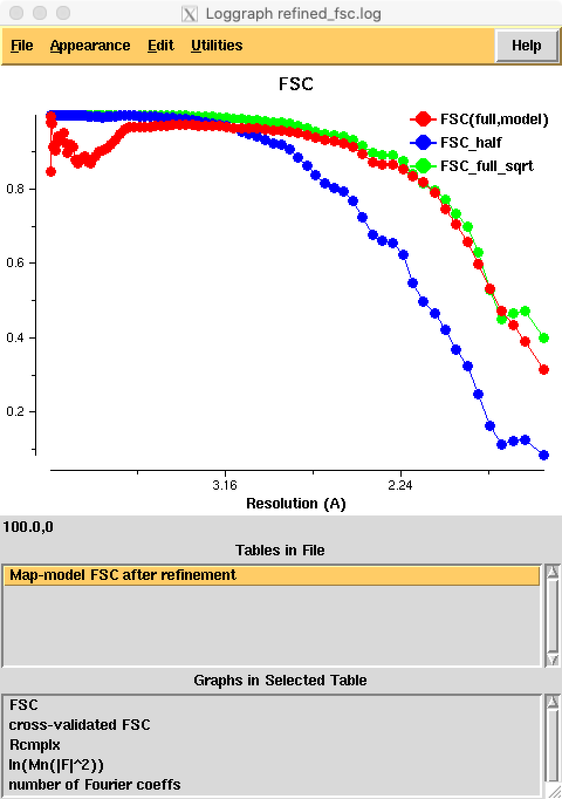
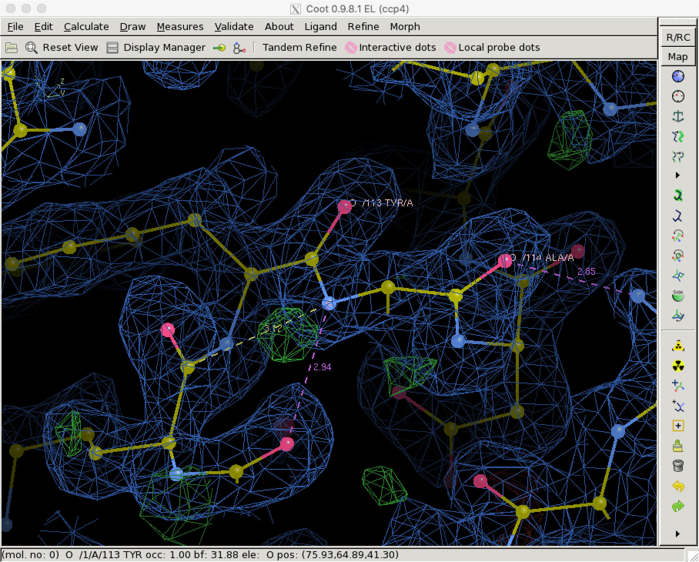

Refinement of ChRmine structure
===============================

Here we demonstrate the atomic model refinement with *C*\ 3 symmetry using ChRmine (`Kishi et al. 2020 <http://dx.doi.org/10.1016/j.cell.2022.01.007>`_, `PDB 7w9w <https://www.rcsb.org/structure/7w9w>`_, `EMD-32377 <https://www.emdataresource.org/EMD-32377>`_).
We need the pdb (or mmcif) file, half maps and mask:
::

    wget https://files.rcsb.org/download/7w9w.pdb
    wget https://files.wwpdb.org/pub/emdb/structures/EMD-32377/other/emd_32377_half_map_1.map.gz
    wget https://files.wwpdb.org/pub/emdb/structures/EMD-32377/other/emd_32377_half_map_2.map.gz
    wget https://files.wwpdb.org/pub/emdb/structures/EMD-32377/masks/emd_32377_msk_1.map

.. note::
    Half maps should be unsharpened and unweighted. In this example, the half maps are from a RELION Refine3D job. The mask file is only used for map calculation after the refinement and does not affect the refinement itself.

**In this example please use at least CCP4 9.0 and Servalcat from it (Servalcat 0.4.72 or newer).**

Run refinement from command-line
--------------------------------
Servalcat's refinement pipeline is available through the refine_spa_norefmac subcommand. It is important to run this command in a new directory, as it creates a lot of files with fixed names by default.

.. code-block:: console

    $ servalcat refine_spa_norefmac \
      --model ../7w9w.pdb \
      --halfmaps ../emd_32377_half_map_1.map.gz ../emd_32377_half_map_2.map.gz \
      --mask_for_fofc ../emd_32377_msk_1.map \
      --pg C3 --resolution 1.95 [--cross_validation]

* ``--halfmaps`` Provide unsharpened and unweighted half maps.
* ``--mask_for_fofc`` This mask is only used for map calculations after refinement and does not affect the refinement itself.
* ``--cross_validation`` Use this option to run cross-validation with half maps. Half map 1 will be used for refinement, and map 2 for validation. Combine this option with ``--randomize 0.3`` to follow the method described in `Brown et al. 2015 <https://doi.org/10.1107/S1399004714021683>`_.
* ``--pg C3`` This option specifies *C*\ 3 symmetry for the map. When using this option, the ``--model`` argument must be an asymmetric unit. The axis orientation and origin follow `RELION's convention <https://relion.readthedocs.io/en/latest/Reference/Conventions.html#symmetry>`_: 3-fold is along z-axis through the centre of the box.
* ``--resolution`` is the resolution used in refinement and map calculation. It is always good to specify a bit higher value than the global one (as determined by the FSC=0.143 criterion), because local resolution can be higher. Here the global resolution was 2.02 Å so I put 1.95 Å.

.. note::
    If the pixel size in map file header is wrong, you can specify the correct pixel size using ``--pixel_size`` option. Note that this affects all input map and mask files, but not for input model. Model should overlap with map with correct the pixel size, and needs to be fixed before refinement if the model is fitted to a map with wrong pixel size.

In case you want to know what Servalcat does in the pipeline:

#. Expand model with *C*\ 3 symmetry (written as input_model_expanded.pdb).
#. Create a mask (mask_from_model.ccp4) around the model with 3 Å radius. A radius can be changed using ``--mask_radius``.
#. Trim half maps using the mask and do Fourier transform of the maps after sharpen-mask-unsharpen procedure
#. Perform refinement of coordinates and ADPs in the reciprocal space, with the following features:
    * hydrogen atoms are internally generated at riding positions; can be changed using ``--hydrogen``
    * hydrogen atoms are not written to the output model; specify ``--hout`` if you want them
    * atomic scattering factors are calculated using Mott-Bethe formula from those for X-ray
    * The number of cycles is 10 by default; can be changed using ``--ncycle``
    * The weight is automatically determined by Servalcat using mask volume ratio and effective resolution; use ``--weight`` to change
    * Output prefix can be changed by ``-o`` (default: refined)

#. Expand the final model with symmetry (refined_expanded.pdb)
#. Calculate map-model FSC (half map 1/2 separately, when ``--cross_validation`` is requested)
#. Calculate sharpened and weighted Fo and Fo-Fc maps (refined_diffmap.mtz, refined_diffmap_normalized_fo.mrc, refined_diffmap_normalized_fofc.mrc)
    * With ``--cross_validation``, only half map 1 is used for these maps. Half map 2 is only used to derive the weights.
    
#. Show final summary

Final summary is like this:

.. code-block:: none

    =============================================================================
    * Final Summary *

    Rmsd from ideal
      bond lengths: 0.0101 A
      bond  angles: 1.871 deg

    Map-model FSCaverages (at 1.95 A):
     FSCaverage(full) =  0.8522
     Run loggraph refined_fsc.log to see plots

    ADP statistics
     Chain A (4708 atoms) min= 23.5 median= 57.8 max=146.9 A^2

    Weight used: 7.430e-01
                 If you want to change the weight, give larger (looser restraints)
                 or smaller (tighter) value to --weight=.
             
    Open refined model and refined_diffmap.mtz with COOT:
    coot --script refined_coot.py

    List Fo-Fc map peaks in the ASU:
    servalcat util map_peaks --map refined_diffmap_normalized_fofc.mrc --model refined.pdb --abs_level 4.0
    =============================================================================

.. _chrmine-check-fsc:

Check FSC
~~~~~~~~~
Use the loggraph command from CCP4 to see the map-model FSC vs resolution curve.

.. code-block:: console

    $ loggraph refined_fsc.log

Note

* Loggraph uses a 1/d^2 scale on the x-axis, while SPA typically uses 1/d.
* Half map FSC (FSC_half) calculations employ sharpened-masked-unsharpened half maps and the mask used during refinement. Phase randomization is currently not performed.
* FSC_full_sqrt estimates correlation between full map and true map: :math:`\sqrt{2{\rm FSC_{half}}/(1+{\rm FSC_{half}})}`. A map-model FSC exceeding this value might indicate overfitting (see `Nicholls et al. 2018 <https://doi.org/10.1107/S2059798318007313>`_).
* FSC curves are calculated up to the Nyquist resolution

The refined_fsc.json file contains the same data as the plot. To use external programs like R or MS Excel for plotting, you can convert it to a CSV file:

.. code-block:: console

    $ servalcat util json2csv refined_fsc.json

Check maps and model
~~~~~~~~~~~~~~~~~~~~
Use the following command to open the refined model and maps in COOT with a script:

.. code-block:: console

    $ coot --script refined_coot.py

Ignore "rmsd" (sigma) contour levels. In SPA, the sigma level displayed as "rmsd" is not meaningful. The arbitrary box size and zero volumes outside the mask lead to underestimation of sigma.
Since a mask file was provided (``--mask_for_fofc``), these maps are normalised within the mask. Therefore, raw map values can be considered as "sigma levels" in the usual crystallographic sense. However, COOT displays these values with incorrect units (e/A^3 or V). Avoid interpreting sigma based on the "rmsd" unit in SPA.

The Fo-Fc map might reveal interesting features. The image below shows putative hydrogen densities displayed at a 3 sigma level. Note that the map includes hydrogen contributions by default. Use ``--hydrogen no`` to generate a hydrogen-omit Fo-Fc map, or run the fofc command after refinement.

For other graphics programs like Chimera or PyMOL, open refined_diffmap_normalized_fo.mrc and refined_diffmap_normalized_fofc.mrc for Fo and Fo-Fc maps, respectively. PyMOL by default scales maps by their "sigma”. Before opening MRC files, run ``set normalize_ccp4_maps, off`` to disable this behaviour.

Run Molprobity
~~~~~~~~~~~~~~
To generate a report for your paper with Ramachandran plots, rotamer outliers, and clash scores, run the following command:

.. code-block:: console

    $ molprobity.molprobity refined_expanded.pdb nqh=false

This will create molprobity_coot.py. Open it with COOT (from Calculate -> Run Script...) to view a "ToDo list". Remember, outliers may not always be errors; verify them with the density map.

.. code-block:: console

    $ coot --script refined_coot.py --script molprobity_coot.py
