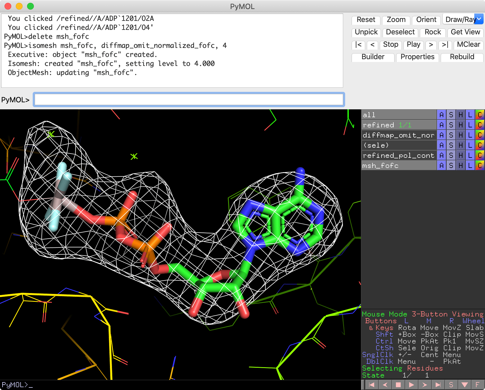

Calculating Fo-Fc omit map
===============================

This guide demonstrates how to calculate a :math:`F_{\rm o}-F_{\rm c}` omit map using Servalcat. A :math:`F_{\rm o}-F_{\rm c}` omit map is a difference map calculated after removing (omitting) certain atoms from the model. This is useful for visualising the presence of ligands or other features not explicitly included in the model.

Before proceeding, you will need 1) unweighted and unsharpened half maps, 2) mask, 3) model files.

Refine the model first!
-----------------------
It is important to refine the model before calculating the :math:`F_{\rm o}-F_{\rm c}` map. At least ADP (B-values) should be refined for a meaningful result.
If you plan to use a PDB model deposited in a public archive, be aware that it might have been refined in a way not ideal for map calculation, such as with grouped ADPs.
Please refer to the :doc:`ChRmine example <chrmine>` for the refinement tutorial.

.. _normalisation-within-mask:

Normalisation within mask
-------------------------
In crystallography, maps are often "sigma-scaled" and displayed with contours at a certain number of sigma (σ). For example, you might see references to ":math:`mF_{\rm o}-DF_{\rm c}` omit map contoured at 3σ" in the literature. This sigma value represents the standard deviation of map values within the unit cell.

However, in SPA, sigma calculated in this way cannot be directly applied. Box size is arbitrary, and everything outside the mask is set to zero. A larger box with more zero-valued pixels results in a smaller sigma, leading to inflated sigma-scaled peak heights.
For details, refer to section 3.3 of `Yamashita et al. (2021) <https://doi.org/10.1107/S2059798321009475>`_.

When you provide a mask file to Servalcat, it calculates maps normalised using a sigma derived from within the mask. Be cautious of sigma-scaled values displayed by other visualisation programs. For example, in Coot, ignore map values with the "rmsd" unit. Focus on the raw map values themselves.
In figure captions, consider using a phrase like ":math:`F_{\rm o}-F_{\rm c}` map contoured at XXσ (where σ is the standard deviation within the mask)."

Tutorial
---------

This tutorial uses the AlF\ :sub:`4`\ \ :sup:`-`\ -ADP–bound state of P4-ATPase flippase (`PDB 6k7k <https://www.rcsb.org/structure/6k7k>`_, `EMD-9937 <https://www.emdataresource.org/EMD-9937>`_) from `Hiraizumi et al. 2019 <https://doi.org/10.1126/science.aay3353>`_ as an example.
We will need the pdb (or mmcif) file, half maps, and mask:
::

    wget https://files.rcsb.org/download/6k7k.pdb
    wget https://files.wwpdb.org/pub/emdb/structures/EMD-9937/other/emd_9937_half_map_1.map.gz
    wget https://files.wwpdb.org/pub/emdb/structures/EMD-9937/other/emd_9937_half_map_2.map.gz
    wget https://files.wwpdb.org/pub/emdb/structures/EMD-9937/masks/emd_9937_msk_1.map

First, refine the model.

.. code-block:: console

    $ servalcat refine_spa_norefmac \
      --model ../6k7k.pdb \
      --halfmaps ../emd_9937_half_map_1.map.gz ../emd_9937_half_map_2.map.gz \
      --mask_for_fofc ../emd_9937_msk_1.map \
      --resolution 2.9

Check the refinement result. To calculate the omit map properly, the overall model quality should be high enough.

Then remove the atoms that you want to see in the omit map. Here, I removed ADP, ALF, and Mg ions (A/1201-1204) using Coot and saved the model as ``refined_omit.pdb``.

Here is the command to calculate the :math:`F_{\rm o}-F_{\rm c}` map:

.. code-block:: console

    $ servalcat fofc \
      --model refined_omit.pdb \
      --halfmaps ../emd_9937_half_map_1.map.gz ../emd_9937_half_map_2.map.gz \
      --mask ../emd_9937_msk_1.map \
      --resolution 2.9 \
      -o diffmap_omit

* ``--halfmaps`` should be unsharpened and unweighted half maps (you used the same half maps for refinement).
* ``--mask`` (not ``--mask_for_fofc``) is used for FSC weighting and normalisation of map values.
* ``--resolution`` likewise, it is always good to specify a bit higher resolution than the global one (as determined by the FSC=0.143 criterion).
* ``-o`` is the prefix of the output file name. Default is ``diffmap``, which would overwrite the file written by ``refine_spa_norefmac`` job if you run in the same directory.

Check omit map with Coot
~~~~~~~~~~~~~~~~~~~~~~~~
Open ``refined.pdb`` and Auto-open ``diffmap_omit.mtz`` in Coot.
In Display Manager, turn off the ``FWT PHWT`` map and adjust the contour level of the ``DELFWT PHDELWT`` map (this is :math:`F_{\rm o}-F_{\rm c}` map).
Then you see:

.. image:: p4_figs/coot_fofc_omit_4sigma.png
    :align: center
    :scale: 30%

Here at the top, "4.000 e/A^3 (11.87rmsd)" is shown. You may think this is contoured at 11.87σ, but no, this is actually at 4σ. In Coot, a value outside the brackets is a raw map value (ignore e/A^3 or V unit!). See `above <#normalisation-within-mask>`_ also.
Note that this normalisation within the mask only happens when ``--mask`` is given.

Check omit map with PyMOL
~~~~~~~~~~~~~~~~~~~~~~~~~
PyMOL by default scales maps with sigma (calculated using all pixels) upon reading of map files. It should be turned off before reading map files. So first start PyMOL with the model file only,

.. code-block:: console

    $ pymol refined.pdb

and then turn off normalisation in PyMOL:
::

    set normalize_ccp4_maps, off
    load diffmap_omit_normalized_fofc.mrc
    isomesh msh_fofc, diffmap_omit_normalized_fofc, 4

You see:

Again, this is the :math:`F_{\rm o}-F_{\rm c}` omit map contoured at 4σ (where σ is the standard deviation within the mask).
